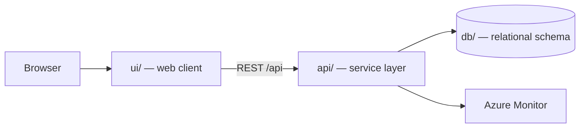

# Field service Work Orders

Generated by the Agentic SDLC workflow.

> Generated by the **Agentic SDLC / Software Factory**. Every change reaches this
> repository through an approved human gate — no agent merges its own work.

## Table of contents

1. [Overview](#overview)
2. [Architecture](#architecture)
3. [API surface](#api-surface)
4. [Screens](#screens)
5. [Folder structure](#folder-structure)
6. [Getting started](#getting-started)
7. [Build and test](#build-and-test)
8. [Deployment](#deployment)
9. [Published links](#published-links)
10. [Requirements scope](#requirements-scope)
11. [Intake documents](#intake-documents)
12. [Licence](#licence)

## Overview

| Item | Value |
| --- | --- |
| Project | Field service Work Orders |
| Business owner | myaacoub@microsoft.com |
| IT owner | myaacoub@microsoft.com |
| Target environment | Dev |
| Work items | Field Service Work Orders |
| Repository | https://github.com/csdmichael/field-service-work-orders |

## Architecture

Three tiers, deployed independently from this single repository:



- **ui/** renders the experience and never talks to the database directly.
- **api/** owns validation, authorization, and all data access.
- **db/** holds the schema and forward-only migrations; no ad-hoc changes.

## API surface

The service publishes an OpenAPI document, so the contract is browsable rather than
described in prose. Swagger UI is at `/docs`; the raw document is at `/openapi.json`.
The published URLs appear under [Published links](#published-links) once the pipeline runs.

| Method | Path | Purpose |
| --- | --- | --- |
| `GET` | `/health` | Liveness probe used by the deploy pipeline |
| `GET` | `/api/work-orders` | List work orders, optionally filtered by `?status=` |
| `POST` | `/api/work-orders` | Create a work order |
| `GET` | `/api/work-orders/{id}` | Fetch one work order |
| `PATCH` | `/api/work-orders/{id}` | Update title, reference, status, priority |
| `DELETE` | `/api/work-orders/{id}` | Remove a work order |

`db/migrations/0002_seed.sql` loads placeholder rows, and the service seeds the same rows,
so a fresh environment returns data on the first request. Replace them with real data.

## Screens

Taken from the approved UX mockups:

- **Work Order Queue**
- **Asset Detail and Diagnostics**
- **Service Log and Parts**
- **Completion and Sign-off**

## Folder structure

```
.
├── ui/                  Web client
│   ├── src/             Application source
│   └── package.json     Scripts and dependencies
├── api/                 Service layer (Python (FastAPI))
│   ├── app/             Routers, models, services
│   ├── tests/           Unit and integration tests
│   └── requirements.txt Runtime dependencies
├── db/                  Database
│   ├── migrations/      Forward-only, numbered migrations
│   └── schema.sql       Current consolidated schema
├── docs/                Project documentation
│   ├── architecture.md  Tiers, data flow, decisions
│   ├── api-contracts.md Endpoint contracts
│   ├── data-model.md    Tables and relationships
│   └── delivery-plan.md Sprints and milestones
├── .github/workflows/   CI and Azure deployment pipelines
├── LICENSE              MIT
└── README.md            This file
```

## Getting started

```bash
# API
cd api && python -m venv .venv && .venv/bin/pip install -r requirements.txt
.venv/bin/uvicorn app.main:app --reload --port 8000

# UI
cd ui && npm install && npm start        # http://localhost:4200

# Database
psql "$DATABASE_URL" -f db/schema.sql
```

## Build and test

| Command | Purpose |
| --- | --- |
| `cd api && python -m pytest -q` | API unit tests |
| `cd ui && npm test` | UI unit tests |
| `.github/workflows/ci.yml` | Runs both on every push and pull request |

## Deployment

`.github/workflows/deploy-azure.yml` publishes the API and UI to Azure App
Service using **OIDC federated credentials** — no stored passwords. Configure
these repository secrets and variables first:

| Name | Kind | Purpose |
| --- | --- | --- |
| `AZURE_CLIENT_ID` / `AZURE_TENANT_ID` / `AZURE_SUBSCRIPTION_ID` | secret | OIDC federated login |
| `API_WEBAPP_NAME` / `UI_WEBAPP_NAME` | variable | Target App Service names |

## Published links

<!-- agentic-sdlc:published-links:start -->
| Component | URL |
| --- | --- |
| UI | <https://field-service-work-orders-ui.azurewebsites.net> |
| API | <https://field-service-work-orders-api.azurewebsites.net> |
| Swagger UI | <https://field-service-work-orders-api.azurewebsites.net/docs> |
| OpenAPI document | <https://field-service-work-orders-api.azurewebsites.net/openapi.json> |
| Work Order API | <https://field-service-work-orders-api.azurewebsites.net/api/work-orders> |
| API health probe | <https://field-service-work-orders-api.azurewebsites.net/health> |

_Published and verified 2026-08-31 20:35 UTC by the Agentic SDLC DevOps & Release Agent via `deploy-azure.yml`. Smoke tests covered the health probe, Swagger/OpenAPI, the UI, and a create/update/delete round trip._
<!-- agentic-sdlc:published-links:end -->

## Requirements scope

- **Database migrations** under `infrastructure/db/migrations/` creating/altering tables noted above plus indexes for SLA risk + criticality sorting.
- **Configuration**: environment variables for APIM endpoint, Foundry agent IDs, Blob containers, tolerance thresholds, offline cache TTL.
- **CI updates**: GitHub Actions workflow to run backend unit tests (pytest), frontend tests (Jest + Cypress component tests), linting, and DB migration check.
- **Offline conflict handling**: implement per-record sync status + idempotent transition tokens to prevent duplicate state changes.
- **Diagnostics agent latency**: wrap agent calls with timeout + fallback messaging; ensure UI doesn’t block critical path.
- **Immutable completion enforcement**: DB transaction plus Blob legal hold to prevent edits; add monitoring for unauthorized write attempts.
- **Inventory consistency**: idempotency keys plus reconciliation job for stuck “pending” entries.
- **Attachment storage cost**: lifecycle management for drafts, immutability only on closure.
- **Traceability**: Every change references corresponding user story ID and acceptance criteria.
- **Security**: Verify Entra claim checks on every endpoint/component, no secrets committed, managed identity only.
- **Offline behavior**: Ensure caches mark stale timestamps and UI indicates pending sync.
- **Idempotency & concurrency**: Review transaction scopes, idempotency tokens, and retry logic.

## Intake documents

- `requirements` — [Field Service Work Orders - Requirements.docx](https://github.com/csdmichael/field-service-work-orders/blob/main/docs/intake/requirements/Field-Service-Work-Orders-Requirements.docx)
- `technical-requirements` — [Field Service Work Orders - Technical Requirements.docx](https://github.com/csdmichael/field-service-work-orders/blob/main/docs/intake/technical-requirements/Field-Service-Work-Orders-Technical-Requirements.docx)
- `ux-mockup` — [Field Service Work Orders - UX Mockups.docx](https://github.com/csdmichael/field-service-work-orders/blob/main/docs/intake/ux-mockups/Field-Service-Work-Orders-UX-Mockups.docx)

## Licence

MIT — see [LICENSE](LICENSE).
