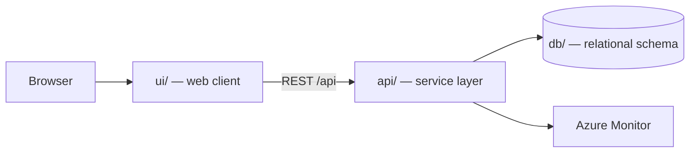

# Field Service Work Orders

Technician mobile app for field service work orders.

> Generated by the **Agentic SDLC / Software Factory**. Every change reaches this
> repository through an approved human gate — no agent merges its own work.

## Table of contents

1. [Overview](#overview)
2. [Architecture](#architecture)
3. [Folder structure](#folder-structure)
4. [Getting started](#getting-started)
5. [Build and test](#build-and-test)
6. [Deployment](#deployment)
7. [Published links](#published-links)
8. [Requirements scope](#requirements-scope)
9. [Intake documents](#intake-documents)
10. [Licence](#licence)

## Overview

| Item | Value |
| --- | --- |
| Project | Field Service Work Orders |
| Business owner | — |
| IT owner | — |
| Target environment | Dev |
| Work items | Field Service Work Orders |
| Repository | https://github.com/csdmichael/field-service-work-orders |

## Architecture

Three tiers, deployed independently from this single repository:



- **ui/** renders the experience and never talks to the database directly.
- **api/** owns validation, authorization, and all data access.
- **db/** holds the schema and forward-only migrations; no ad-hoc changes.

## Folder structure

```
.
├── ui/                  Web client
│   ├── src/             Application source
│   └── package.json     Scripts and dependencies
├── api/                 Service layer (FastAPI)
│   ├── app/             Routers, models, services
│   ├── tests/           Unit and integration tests
│   └── requirements.txt Runtime dependencies
├── db/                  Database
│   ├── migrations/      Forward-only, numbered migrations
│   └── schema.sql       Current consolidated schema
├── docs/                Project documentation
│   ├── architecture.md  Tiers, data flow, decisions
│   ├── api-contracts.md Endpoint contracts
│   ├── data-model.md    Tables and relationships
│   └── delivery-plan.md Sprints and milestones
├── .github/workflows/   CI and Azure deployment pipelines
├── LICENSE              MIT
└── README.md            This file
```

## Getting started

```bash
# API
cd api && python -m venv .venv && .venv/bin/pip install -r requirements.txt
.venv/bin/uvicorn app.main:app --reload --port 8000

# UI
cd ui && npm install && npm start        # http://localhost:4200

# Database
psql "$DATABASE_URL" -f db/schema.sql
```

## Build and test

| Command | Purpose |
| --- | --- |
| `cd api && python -m pytest -q` | API unit tests |
| `cd ui && npm test` | UI unit tests |
| `.github/workflows/ci.yml` | Runs both on every push and pull request |

## Deployment

`.github/workflows/deploy-azure.yml` publishes the API and UI to Azure App
Service using **OIDC federated credentials** — no stored passwords. Configure
these repository secrets and variables first:

| Name | Kind | Purpose |
| --- | --- | --- |
| `AZURE_CLIENT_ID` / `AZURE_TENANT_ID` / `AZURE_SUBSCRIPTION_ID` | secret | OIDC federated login |
| `API_WEBAPP_NAME` / `UI_WEBAPP_NAME` | variable | Target App Service names |

## Published links

<!-- agentic-sdlc:published-links:start -->
_Populated automatically once the deployment pipeline succeeds._
<!-- agentic-sdlc:published-links:end -->

## Requirements scope

- [Field Service Work Orders - Requirements.docx](https://github.com/csdmichael/field-service-work-orders/blob/main/docs/intake/requirements/Field-Service-Work-Orders-Requirements.docx)
- Defines scope, epics, features, user stories, acceptance criteria, non-functional requirements, traceability, assumptions, and out-of-scope items.
- **Purpose & Scope:** Technician mobile app for field service work orders; demo artifact for traceability and document management.
- **Epic:** Receive, diagnose, and complete work orders from a handheld device.
- **Features & User Stories:**
- FEAT-01: Work Order Queue and Dispatch (US-101, US-102)
- FEAT-02: Asset Detail and Diagnostics (US-201, US-202)
- FEAT-03: Service Log and Parts (US-301, US-302)
- FEAT-04: Completion and Sign-off (US-401, US-402)
- **Non-Functional Requirements:** Performance, availability, offline capability, security, accessibility, auditability, integration.
- **Traceability:** Features mapped to screens in UX mockups.
- **Assumptions & Out of Scope:** Upstream systems, device management, network coverage, excluded features.

## Intake documents

- `requirements` — [Field Service Work Orders - Requirements.docx](https://github.com/csdmichael/field-service-work-orders/blob/main/docs/intake/requirements/Field-Service-Work-Orders-Requirements.docx)
- `ux-mockup` — [Field Service Work Orders - UX Mockups.docx](https://github.com/csdmichael/field-service-work-orders/blob/main/docs/intake/ux-mockups/Field-Service-Work-Orders-UX-Mockups.docx)

## Licence

MIT — see [LICENSE](LICENSE).
